# Lecture 16: Data Warehouse & Snowflake

## 目录

- [了解什么是 SCD (Slow Changing Dimension)](#了解什么是-scd-slow-changing-dimension)
- [图示讲解颗粒度 (Grain)](#图示讲解颗粒度-grain)
- [讲解 Dimension Hierarchy 技术](#讲解-dimension-hierarchy-技术)
- [Fact Table 高阶技术](#fact-table-高阶技术)
- [Dimension Table 高阶技术](#dimension-table-高阶技术)
- [参考资料](#参考资料)
- [总结](#总结)

### 了解什么是 SCD (Slow Changing Dimension)

SCD（Slow Changing Dimension）是指在数据仓库中处理维度数据变化的方法。以下是常见的 SCD 类型：

- **Type 0: Fixed Dimension**：维度数据不会发生变化。
- **Type 1: Overwrite**：直接覆盖旧值，不保留历史记录。
- **Type 2: Add Row**：添加新行来存储变化的数据，保留历史记录。
- **Type 3: Add Column**：添加新列来存储变化前后的数据，保留部分历史记录。

[阅读更多](https://python.plainenglish.io/understanding-slowly-changing-dimensions-scd-in-data-warehousing-20a566ae3fdd)

### 图示讲解颗粒度 (Grain)

数据仓库中的颗粒度是指数据的详细程度。在设计数据仓库时，颗粒度的选择非常重要，因为它影响数据的存储和查询性能。

- **Fine Grain**：数据记录非常详细，适用于需要精确分析的场景。
- **Coarse Grain**：数据记录较为概括，适用于需要快速汇总分析的场景。

[阅读更多](https://docs.getdbt.com/terms/grain)

### 讲解 Dimension Hierarchy 技术

维度层次结构在数据仓库设计中用于表示数据的多级分类和聚合。以下是几种常见的维度层次结构：

- **Fixed Depth Positional Hierarchies**：每个层次的深度是固定的。

  - [阅读更多](https://www.kimballgroup.com/data-warehouse-business-intelligence-resources/kimball-techniques/dimensional-modeling-techniques/fixed-depth-hierarchy/)
  - 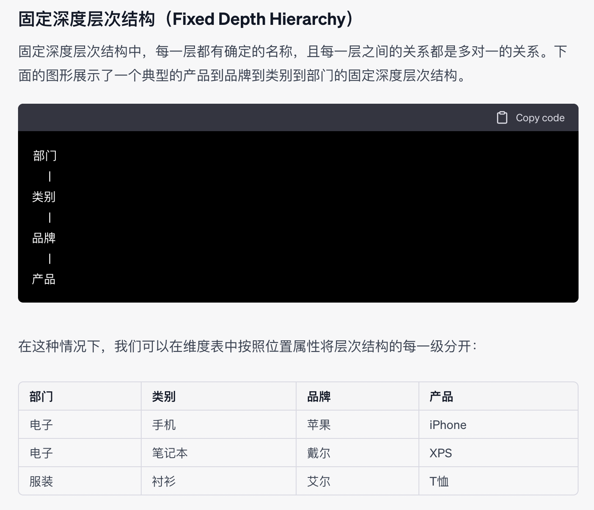

- **Slightly Ragged/Variable Depth Hierarchies**：层次结构的深度可以有所变化。

  - [阅读更多](https://www.kimballgroup.com/data-warehouse-business-intelligence-resources/kimball-techniques/dimensional-modeling-techniques/slightly-ragged-variable-depth-hierarchy/)
  - 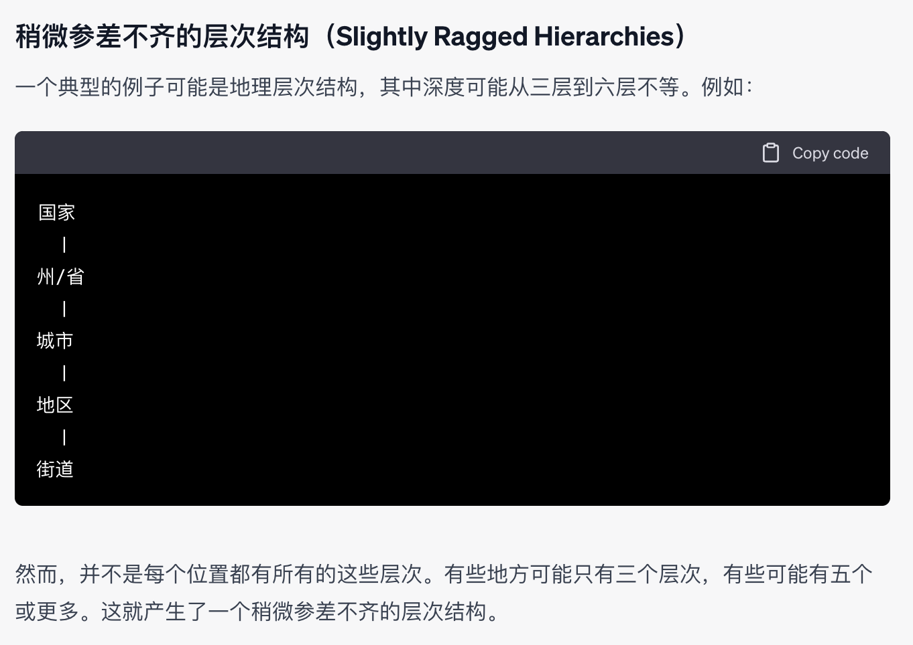

- **Ragged/Variable Depth Hierarchies**：使用桥接表和路径字符串属性来处理不确定深度的层次结构。
  - [阅读更多](https://www.kimballgroup.com/data-warehouse-business-intelligence-resources/kimball-techniques/dimensional-modeling-techniques/ragged-variable-depth-hierarchy/)
  - 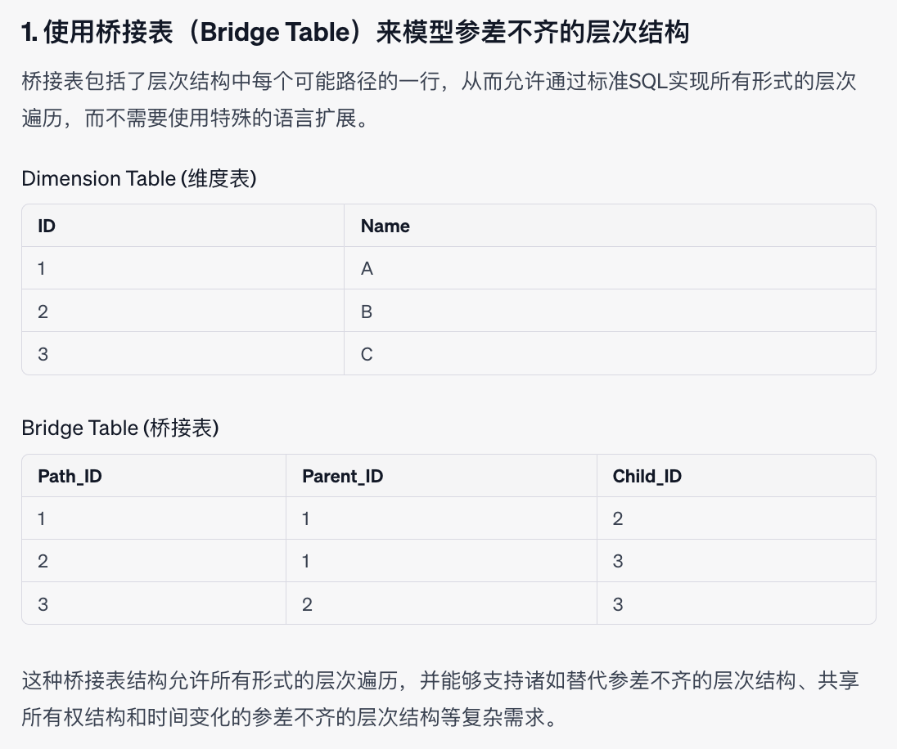

### Fact Table 高阶技术

1. **Surrogate Key**

   - 代理键在数据仓库设计中用于实现维度表的主键。代理键通常是简单的整数，便于查询和存储。
   - [阅读更多](https://www.kimballgroup.com/data-warehouse-business-intelligence-resources/kimball-techniques/dimensional-modeling-techniques/fact-surrogate-key/)
   - 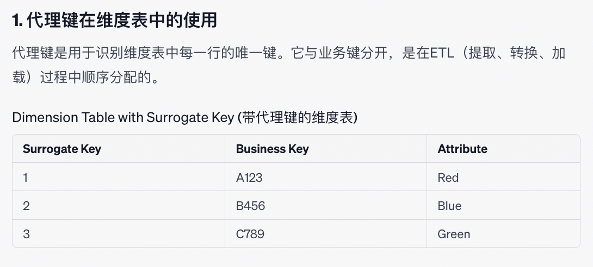

2. **Centipede Fact Table**

   - 避免为多对一层次结构的每个级别创建单独的规范化维度，以避免“蜈蚣事实表”。
   - 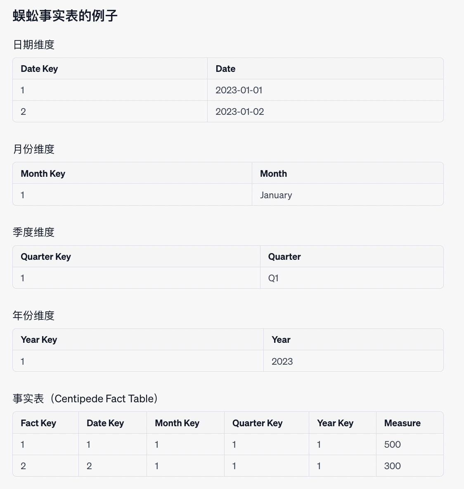

3. **Numeric Value as Attribute**

   - 处理不明确属于事实还是维度属性类别的数字值，如产品的标准零售价。
   - [阅读更多](https://www.kimballgroup.com/data-warehouse-business-intelligence-resources/kimball-techniques/dimensional-modeling-techniques/numeric%20-attribute-fact/)
   - 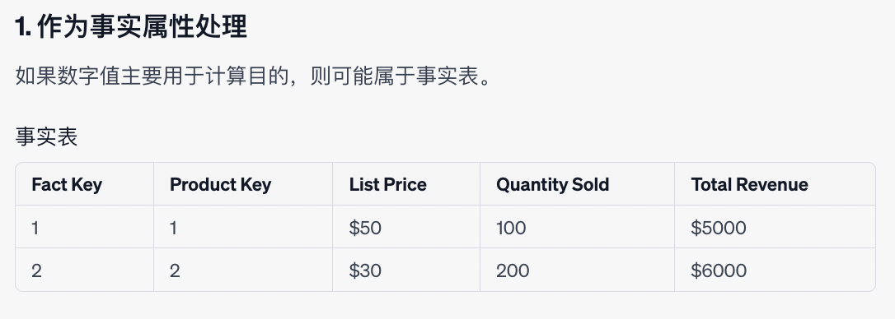

4. **Lag/Duration Facts**

   - 累积快照事实表捕获多个过程里程碑，并分析这些里程碑之间的延迟或持续时间。
   - [阅读更多](https://www.kimballgroup.com/data-warehouse-business-intelligence-resources/kimball-techniques/dimensional-modeling-techniques/lag-duration-fact/)
   - 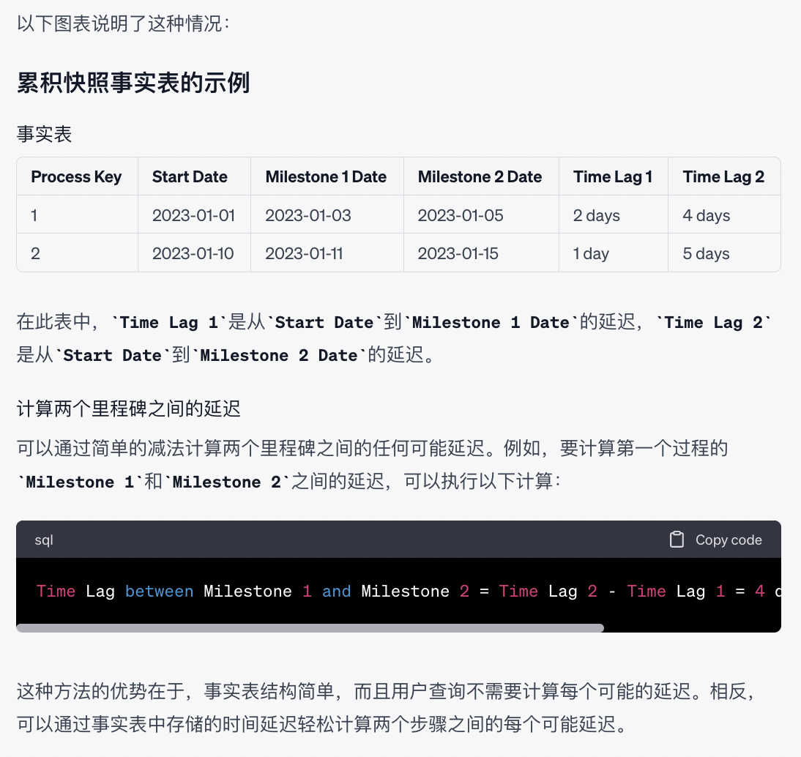

5. **Header/Line Fact Table**

   - 不同方法建模头/行项目信息，并指出两种错误方法和一种推荐结构。
   - [阅读更多](https://www.kimballgroup.com/2007/10/design-tip-95-patterns-to-avoid-when-modeling-headerline-item-transactions/)
   - 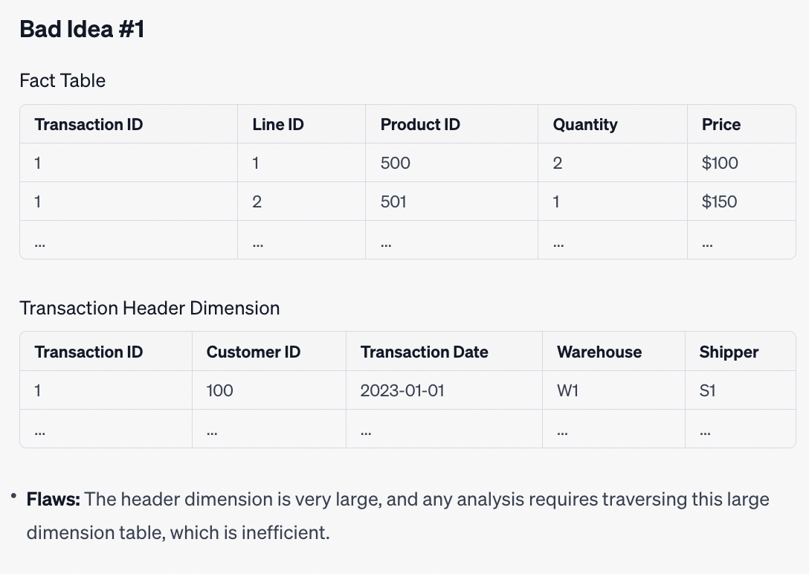

6. **Allocated Facts**

   - 处理分配的事实数据，如利润和损失表。
   - [阅读更多](https://www.kimballgroup.com/data-warehouse-business-intelligence-resources/kimball-techniques/dimensional-modeling-techniques/allocated-fact/)

7. **Multiple Currency Facts**

   - 记录多种货币的财务交易，并使用标准货币进行转换。
   - [阅读更多](https://www.kimballgroup.com/data-warehouse-business-intelligence-resources/kimball-techniques/dimensional-modeling-techniques/multiple-currencies/)
   - 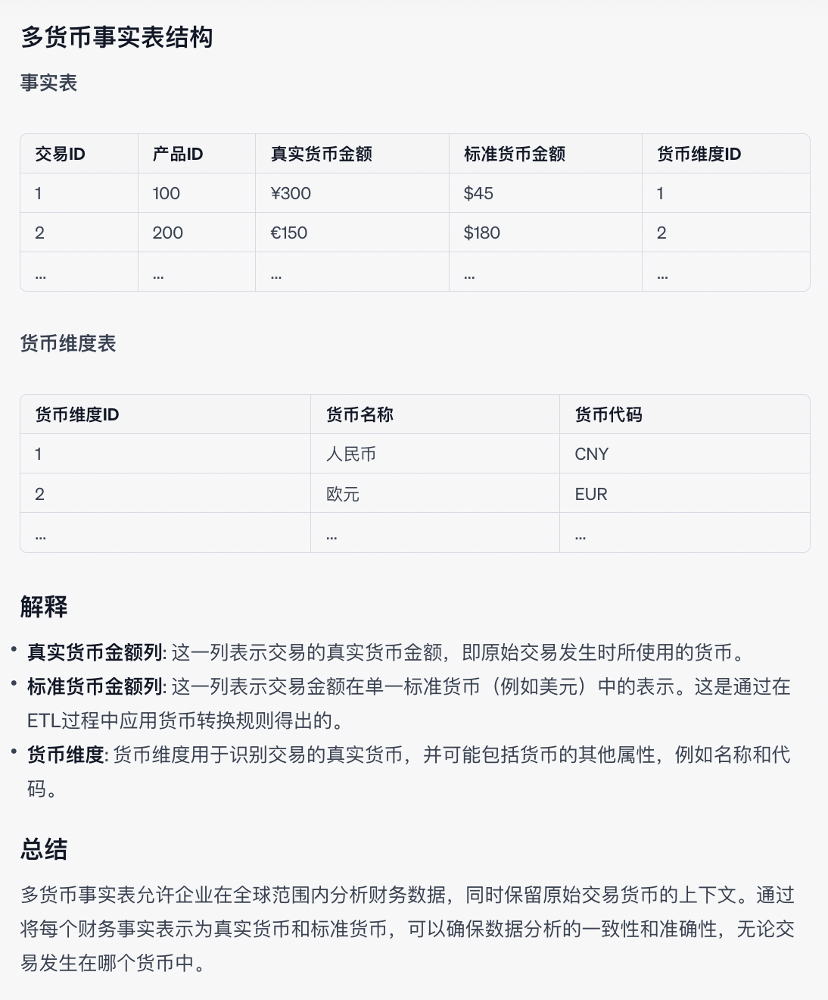

8. **Multiple Units of Measure**

   - 处理同时以多个度量单位表示的事实数据。
   - [阅读更多](https://www.kimballgroup.com/data-warehouse-business-intelligence-resources/kimball-techniques/dimensional-modeling-techniques/multiple-units-of-measure/)
   - 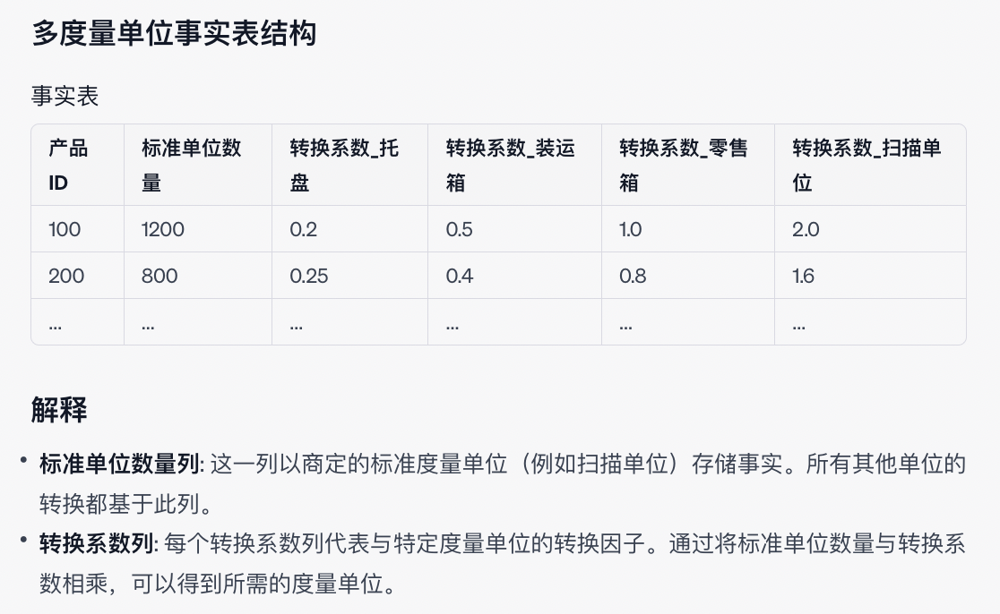

9. **Year-to-Date Facts**

   - 处理年度累计的事实数据。
   - [阅读更多](https://www.kimballgroup.com/data-warehouse-business-intelligence-resources/kimball-techniques/dimensional-modeling-techniques/year-to-date-fact/)
   - 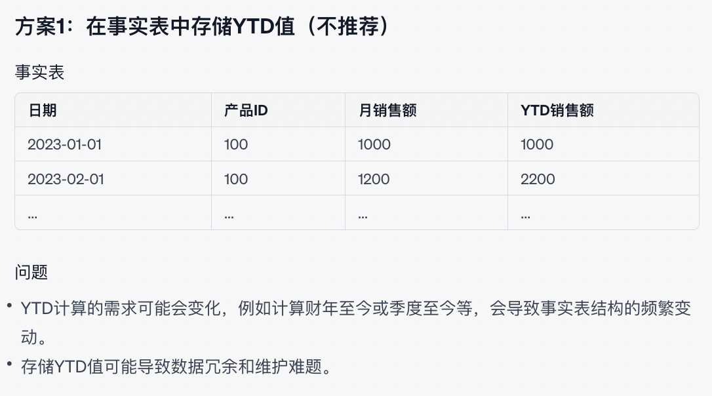

10. **Multipass SQL**

    - 避免直接 SQL 连接多个事实表，以防止结果不正确。使用“跨钻取”技术。
    - [阅读更多](https://stackoverflow.com/questions/42629656/how-to-avoid-joins-between-fact-tables-in-a-star-schema)
    - 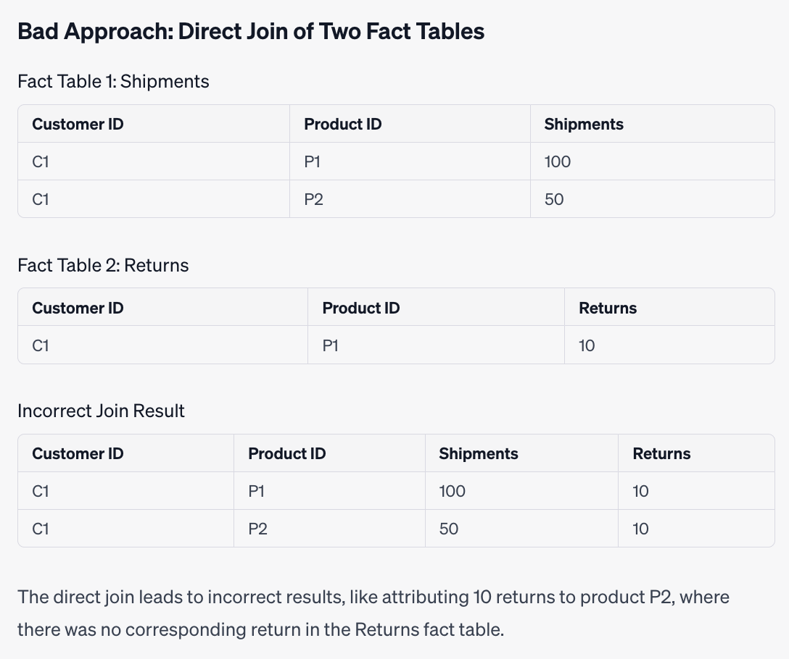

11. **Timespan Tracking in Fact Tables**

    - 为事实表添加行生效日期、行到期日期和当前行指示符，以捕捉事实行的时间跨度。
    - [阅读更多](https://www.kimballgroup.com/data-warehouse-business-intelligence-resources/kimball-techniques/dimensional-modeling-techniques/timespan-fact-table/)
    - 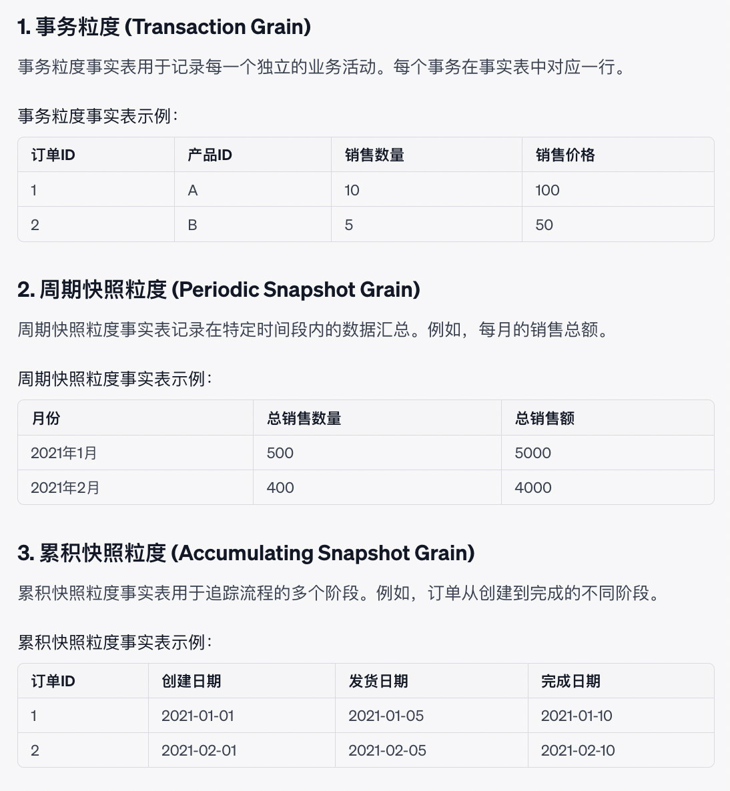

12. **Late Arriving Facts**
    - 处理迟到的事实数据，并确保数据的一致性和准确性。
    - [阅读更多](https://www.kimballgroup.com/data-warehouse-business-intelligence-resources/kimball-techniques/dimensional-modeling-techniques/late-arriving-fact/)
    - 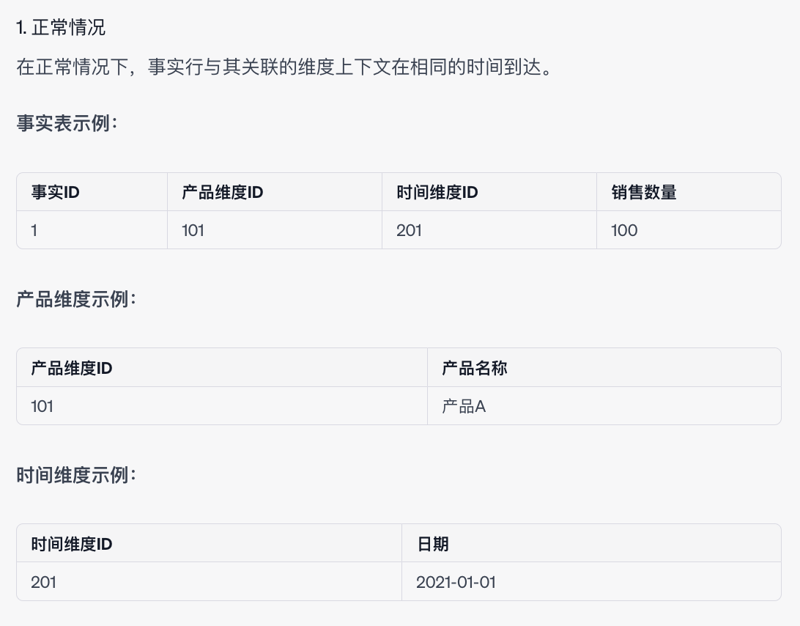

### Dimension Table 高阶技术

1. **Dimension-to-Dimension Table Joins**

   - 处理维度之间的关联，并避免基础维度的“爆炸式”增长。
   - [阅读更多](https://www.kimballgroup.com/data-warehouse-business-intelligence-resources/kimball-techniques/dimensional-modeling-techniques/dimension-to-dimension-join/)
   - 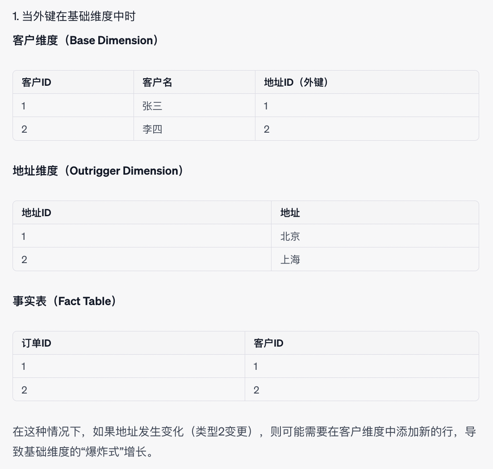

2. **Multivalued Dimension & Bridge Table**

   - 处理具有多个值的维度，并使用桥接表进行建模。
   - [阅读更多](https://www.kimballgroup.com/data-warehouse-business-intelligence-resources/kimball-techniques/dimensional-modeling-techniques/multivalued-dimension-bridge-table/)
   - 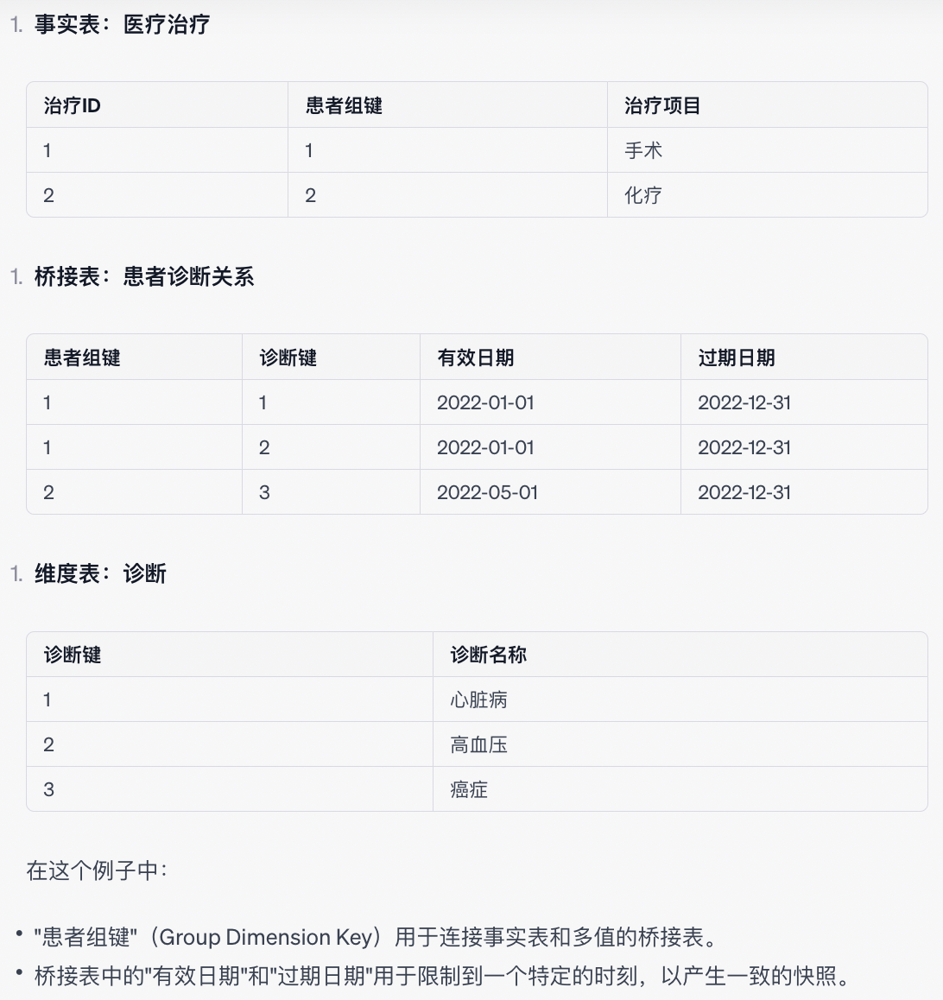

3. **Behaviour Tag Time Series**
   - 追踪和分析客户行为的变化趋势。
   - [阅读更多](https://www.kimballgroup.com/data-warehouse-business-intelligence-resources/kimball-techniques/dimensional-modeling-techniques/behavior-tag-series-attribute/)
   - 

4. **Behaviour Study Group**

   - 捕获复杂行为分析的结果，并使用持久键标识。
   - [阅读更多](https://www.kimballgroup.com/data-warehouse-business-intelligence-resources/kimball-techniques/dimensional-modeling-techniques/behavior-study-group/)
   - 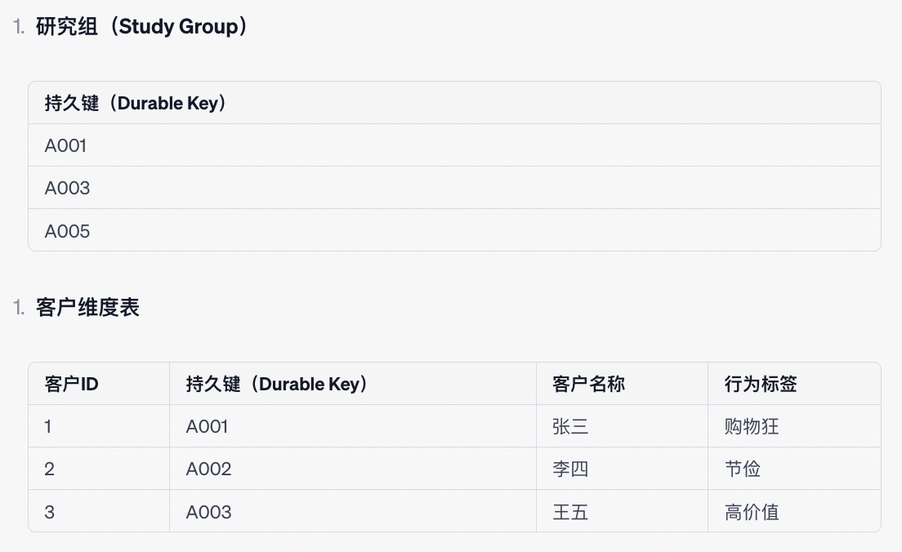

5. **Aggregated Facts as Dimension Attributes**

   - 将汇总性能指标包含在维度表中，便于 BI 分析。
   - [阅读更多](https://www.kimballgroup.com/data-warehouse-business-intelligence-resources/kimball-techniques/dimensional-modeling-techniques/aggregated-fact-attribute/)
   - 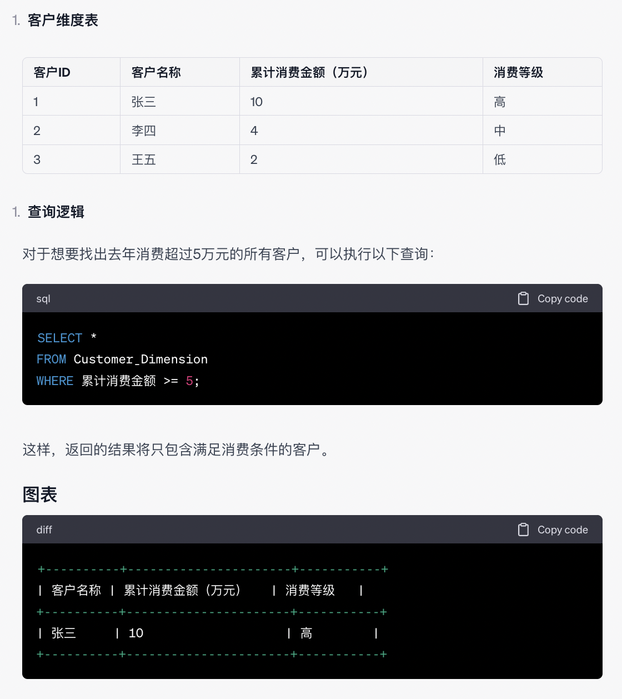

6. **Dynamic Value Banding**

   - 处理动态变化的值分段。
   - [阅读更多](https://www.kimballgroup.com/data-warehouse-business-intelligence-resources/kimball-techniques/dimensional-modeling-techniques/dynamic-value-banding/)

7. **Text Comments**

   - 处理和存储文本评论。
   - [阅读更多](https://www.kimballgroup.com/data-warehouse-business-intelligence-resources/kimball-techniques/dimensional-modeling-techniques/text-comment/)

8. **Multiple Time Zones**

   - 处理跨多个时区的数据。
   - [阅读更多](https://www.kimballgroup.com/data-warehouse-business-intelligence-resources/kimball-techniques/dimensional-modeling-techniques/multiple-time-zones/)

9. **Step Dimension**

   - 处理分步过程的维度。
   - [阅读更多](https://www.kimballgroup.com/data-warehouse-business-intelligence-resources/kimball-techniques/dimensional-modeling-techniques/step-dimension/)

10. **Hot Swappable Dimension**

    - 处理可动态插拔的维度。
    - [阅读更多](https://www.kimballgroup.com/data-warehouse-business-intelligence-resources/kimball-techniques/dimensional-modeling-techniques/hot-swappable-dimension/)

11. **Abstract Generic Dimensions**

    - 处理通用维度的抽象。
    - [阅读更多](https://www.kimballgroup.com/data-warehouse-business-intelligence-resources/kimball-techniques/dimensional-modeling-techniques/abstract-generic-dimensions/)

12. **Audit Dimension**

    - 处理审计信息的维度。
    - [阅读更多](https://www.kimballgroup.com/data-warehouse-business-intelligence-resources/kimball-techniques/dimensional-modeling-techniques/audit-dimension/)

13. **Late Arriving Dimensions**

    - 处理迟到的维度数据。
    - [阅读更多](https://www.kimballgroup.com/data-warehouse-business-intelligence-resources/kimball-techniques/dimensional-modeling-techniques/late-arriving-dimensions/)

14. **Supertype and Subtype Schemas for Heterogeneous Products**

    - 处理异构产品的超类型和子类型。
    - [阅读更多](https://www.kimballgroup.com/data-warehouse-business-intelligence-resources/kimball-techniques/dimensional-modeling-techniques/supertype-subtype-schemas/)

15. **Real Time Fact Table**

    - 处理实时数据的事实表。
    - [阅读更多](https://www.kimballgroup.com/data-warehouse-business-intelligence-resources/kimball-techniques/dimensional-modeling-techniques/real-time-fact-table/)

16. **Error Event Schemas**
    - 处理错误事件的模式。
    - [阅读更多](https://www.kimballgroup.com/data-warehouse-business-intelligence-resources/kimball-techniques/dimensional-modeling-techniques/error-event-schemas/)

## 参考资料

- [Kimball_The-Data-Warehouse-Toolkit-3rd-Edition](assets/pdf/Kimball_The-Data-Warehouse-Toolkit-3rd-Edition.pdf)
- [Glossary of Dimensional Modeling Techniques](https://www.kimballgroup.com/data-warehouse-business-intelligence-resources/kimball-techniques/dimensional-modeling-techniques/)

## 总结

本次课程详细讲解了数据仓库和 Snowflake Python 的相关知识。通过对 SCD、颗粒度、维度层次结构、Fact Table 和 Dimension Table 的深入探讨，学生们可以全面了解数据仓库设计和实现的关键技术。这些知识点不仅理论丰富，还结合实际案例，帮助学生更好地理解和应用。通过系统的学习和实践，学生将能够在实际项目中熟练应用这些技能，提升数据工程的能力。
